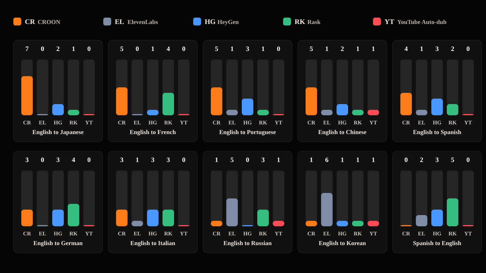

# CROON Dubbing Evaluation

CROON ranked #1 in 5 of 10 target languages in a shuffled anonymous Gemini dubbing benchmark.



## Result

- CROON won: Japanese, French, Portuguese, Chinese, Spanish
- Compared against: ElevenLabs, HeyGen, Rask, YouTube Auto-dub
- Metric: top-1 votes across 10 shuffled anonymous rounds per language
- Clip: first 60 seconds of each source video

Full report: https://croondottv.github.io/evaluation/

## Method

Each evaluation round uses:

- one original source clip
- five dubbed candidates for the same `00:00-01:00` range
- anonymous labels, Candidate A through Candidate E
- shuffled candidate order
- Gemini ranking by dubbing quality

The prompt asks Gemini to judge translation accuracy, spoken naturalness, voice similarity, speaker separation, and timing alignment. It explicitly says not to reward video resolution or bitrate.

## Reproduce

Prepare these local files for each benchmark case:

| File | Description |
| --- | --- |
| Source clip | Original source video, first 60 seconds |
| CROON output | Dubbed output for the same range |
| ElevenLabs output | Dubbed output for the same range |
| HeyGen output | Dubbed output for the same range |
| Rask output | Dubbed output for the same range |
| YouTube Auto-dub | YouTube dubbed audio/video for the same range |

Then fill `examples/manifest.example.json` and run:

```bash
python3 scripts/evaluate_relative_ranking.py \
  --manifest examples/manifest.example.json \
  --out runs/example \
  --rounds 10 \
  --seed 760
```

Raw ranking rows are in `data/rounds/`. The source and dubbed media files are not redistributed in this repository.
